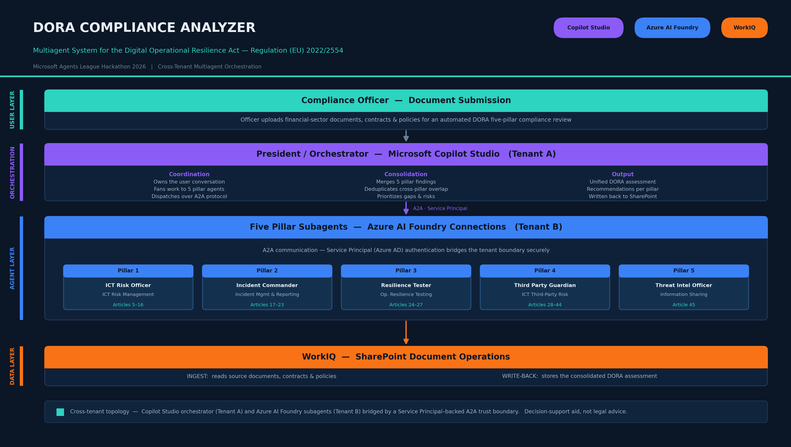

# DORA Multiagent Compliance Analyzer


> A multiagent system that analyzes financial-sector documents, contracts, and policies against the five pillars of **DORA — the Digital Operational Resilience Act (Regulation (EU) 2022/2554)**.

A **President/Orchestrator** agent coordinates five specialized subagents, each an expert in one DORA pillar. Every subagent independently reviews the input material from its own regulatory lens; the orchestrator then consolidates their findings into a single, cross-pillar compliance assessment.

---

## 📺 Demo Video

A walkthrough video is available on the project site. Refer to it for a full end-to-end demonstration of the orchestration flow, the agent-to-agent (A2A) handoffs, and the SharePoint operations in action.

---

## 🏛️ Architecture Overview



```

### Key architectural elements

- **Agent-to-Agent (A2A) communication with a Service Principal.** The orchestrator communicates with each subagent over the A2A protocol. Authentication and authorization between agents are handled by an Azure AD **Service Principal**, providing a secure, non-interactive, credential-scoped trust boundary for every agent call.

- **Subagents as Azure AI Foundry connections.** All five pillar agents are deployed and exposed through **Azure AI Foundry**. Each is registered as a Foundry connection that the orchestrator invokes, keeping model hosting, grounding, and tooling centralized in Foundry.

- **Orchestrator on Copilot Studio.** The President/Orchestrator runs in **Microsoft Copilot Studio**. It owns the conversation with the user, dispatches work to the subagents, and synthesizes the consolidated DORA report.

- **Cross-tenant topology.** The orchestrator (Copilot Studio) and the subagents (Azure AI Foundry) live in **two different tenants**. The Service Principal–backed A2A connection is what bridges the tenant boundary securely, demonstrating a realistic multi-tenant enterprise integration pattern.

- **WorkIQ for SharePoint operations.** **WorkIQ** is used to perform all document operations on **SharePoint** — reading source documents, contracts, and policies for analysis, and writing back the generated compliance assessments.

---

## 🤖 The Agents

### President / Orchestrator
Coordinates the analysis. Receives the documents under review, fans the work out to the five pillar specialists via A2A, collects each pillar's findings, and produces a unified, prioritized, cross-pillar DORA compliance assessment.

### 1. ICT Risk Officer — *Pillar 1*
Specialized in DORA (Regulation (EU) 2022/2554), with expertise in **Pillar 1: ICT Risk Management (Articles 5–16)**. Evaluates the ICT risk management framework, governance, protection and prevention measures, detection, response, recovery, and learning processes.

### 2. Incident Commander — *Pillar 2*
Specialized in DORA, with expertise in **Pillar 2: ICT-Related Incident Management, Classification and Reporting (Articles 17–23)**. Assesses incident handling processes, classification criteria, and major-incident reporting obligations.

### 3. Resilience Tester — *Pillar 3*
Specialized in **DORA Pillar 3: Digital Operational Resilience Testing (Articles 24–27)**. Reviews the digital operational resilience testing programme, including threat-led penetration testing (TLPT) requirements.

### 4. Third Party Guardian — *Pillar 4*
Specialized in DORA, with expertise in **Pillar 4: Managing of ICT Third-Party Risk (Articles 28–44)**. Analyzes contractual arrangements with ICT third-party providers, concentration risk, subcontracting, and oversight of critical third-party providers.

### 5. Threat Intelligence Officer — *Pillar 5*
An expert in information sharing and threat intelligence within the financial sector. Analyzes documents, contracts, and policies from the perspective of **DORA Pillar 5: Information Sharing (Article 45)**.

---

## ⚙️ How It Works

1. **Ingestion** — Source documents, contracts, and policies are pulled from **SharePoint** via **WorkIQ**.
2. **Dispatch** — The **Copilot Studio** orchestrator routes the material to all five **Foundry**-hosted subagents over **A2A**, authenticated via the **Service Principal** (crossing the tenant boundary between Copilot Studio and Foundry).
3. **Independent analysis** — Each pillar agent reviews the material against its assigned DORA articles and returns structured findings (gaps, risks, compliant areas, recommendations).
4. **Consolidation** — The orchestrator merges the five perspectives, deduplicates cross-pillar overlaps, and prioritizes findings.
5. **Output** — The final consolidated DORA compliance assessment is written back to **SharePoint** through **WorkIQ**.

---

## 🧱 Tech Stack

| Layer | Technology |
|-------|------------|
| Orchestrator | Microsoft Copilot Studio (Tenant A) |
| Subagents (5 pillars) | Azure AI Foundry connections (Tenant B) |
| Inter-agent communication | A2A protocol with Service Principal authentication |
| Document operations | WorkIQ on SharePoint |
| Regulatory scope | DORA — Regulation (EU) 2022/2554 |

---

See the **demo video on the project site** for the full live walkthrough.

---

## ⚠️ Disclaimer

This tool provides automated analysis to support DORA compliance review. It is a decision-support aid, not legal advice. All findings should be validated by qualified compliance and legal professionals before action.
